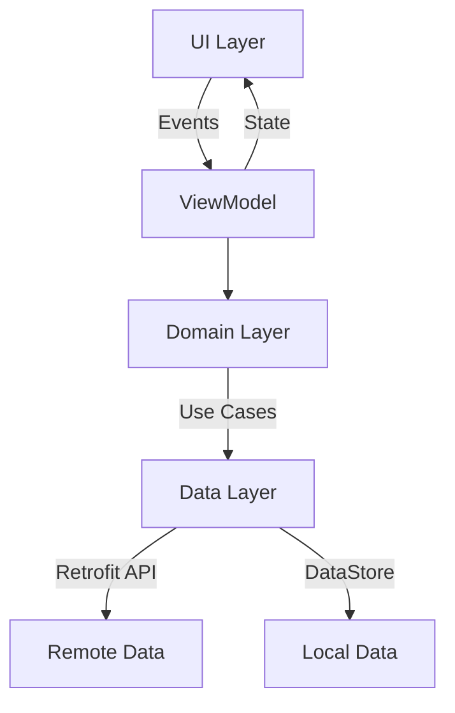

#  SwapWise  

[](https://kotlinlang.org/)  
[](https://developer.android.com/jetpack/compose)  
[](https://dagger.dev/hilt/)  
[](https://developer.android.com/jetpack/guide)  
[](https://github.com/IugGraduation/Android/commits/main)  

**An offer-based bartering app showcasing modern Android development with Jetpack Compose & Recommended app Architecture**  

---

## 📌 Overview  
A feature-rich Android trading platform demonstrating:  
- **10+ screens** built with Jetpack Compose  
- **MVVM** architecture with Hilt Dependency Injection  
- Optimized state management using **StateFlow & Coroutines**  
- Collaborative development via **GitHub Organization**  

*(Note: Project is for code demonstration only – backend services are currently offline.)*

---

## ✨ Features  
**✅ Offer-Based Trading** – Users can propose and negotiate item swaps.  
**✅ Jetpack Compose UI** – Smooth, responsive UI with custom components.  
**✅ State Management** – Powered by StateFlow and coroutines for real-time updates.  
**✅ Error Handling** – Centralized via BaseViewModel & BaseUiState.  
**✅ Debounced Search** – Optimized search input to prevent unnecessary API calls.  
**✅ Swipe Gestures & Animations** – Enhances usability and engagement.  
**✅ Auto-Login** – Secure user sessions via DataStore.  

---

## 🏗 Architecture  
**MVVM with Recommended Architecture**  


---

## 🛠 Tech Stack

| **Technology**         | **Purpose**                    |
|------------------------|--------------------------------|
| Kotlin                 | Primary language               |
| Jetpack Compose        | Declarative UI framework       |
| Hilt                   | Dependency Injection           |
| Retrofit               | API communication              |
| StateFlow + Coroutines | State management               |
| DataStore              | Local data storage             |

---

## 📥 Installation

1. Clone the repository:

   ```bash
   git clone https://github.com/your-username/SwapWise.git

2. Open in Android Studio

3. Build & run `app` module

---

## UI Preview 📸

<table>
  <tr>
    <th>Home Screen</th>
    <th>Search</th>
    <th>Notifications</th>
  </tr>
  <tr>
    <td valign="top"></td>
    <td valign="top"></td>
    <td valign="top"></td>
  </tr>
  <tr>
    <th>Post Details</th>
    <th>Profile</th>
    <th>Settings</th>
  </tr>
  <tr>
    <td valign="top"></td>
    <td valign="top"></td>
    <td valign="top"></td>
  </tr>
</table>

---

## 🚀 Development Highlights  
- **15% faster state management** with reusable `BaseViewModel` & `BaseUiState` for centralized state & error handling.  
- **Enhanced UX** with debounced search and custom swipe gestures for seamless interactions.  
- **Efficient navigation** using Jetpack Compose `NavController` for smooth app flow.  
- **250+ structured commits** managed via GitHub, Trello, and Figma for streamlined collaboration.

---

## 🤝 Collaboration  
### Team Tools  
- **GitHub Organization** for repository management and version control.  
- **Figma** for seamless UI/UX design handoff and collaboration.  
- **Trello** for task tracking and project management.  
- **WhatsApp** for real-time team communication and coordination.

---

## 📬 Contact

For questions or feedback, reach out at:
- [Email](mailto:SameerMMurtaja@gmail.com "Email SameerMMurtaja@gmail.com")
- [LinkedIn](https://www.linkedin.com/in/sameer-murtaja/ "View Sameer's LinkedIn")
